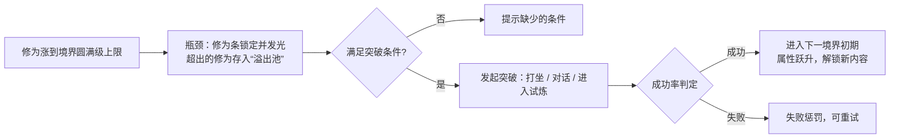

# 《仙途岛》第三阶段系统设计：境界、功法、炼丹、炼器（框架 v0.1）

> 主策划：天机阁 ｜ 状态：框架，标 **【演武堂】** 的数值待演武堂填写，落表 `balance/realms.json`、`skills.json`、`recipes.json`、`materials.json`
> 范围：炼气 → 筑基 → 金丹，三个境界（10–99 级）。

---

## 一、境界突破

### 1.1 通用流程（所有大境界都套用）

- **瓶颈**：到达圆满级（9 / 29 / 59 / 99 级）且修为满后，不再升级。超出的修为进入「溢出池」，上限为下一级所需修为的 **【演武堂】%**；突破成功后一次性返还，让卡瓶颈期间打的怪不白打。
- **突破入口**：大境界的突破都要用一个**单人试炼**做演出，小阶段（初、中、后期）只按等级显示，不用突破。

### 1.2 各境界突破条件
| 突破 | 等级 | 必要条件 | 试炼 | 基础成功率 |
|---|---|---|---|---|
| 凡人 → 炼气 | 9→10 | 任务「引气入体」 | 无（对话演出） | 100% |
| 炼气 → 筑基 | 29→30 | 筑基丹 ×1 + 宗门长老考核任务 | **筑基台**：单人限时关卡，60 秒内守住聚灵阵不被妖兽打断 | 【演武堂】 |
| 筑基 → 金丹 | 59→60 | 凝金丹 ×1 + 道心 ≥ 【演武堂】 | **凝丹副本**：击败「心魔」（复制玩家技能的镜像） | 【演武堂】 |

### 1.3 成功率修正
最终成功率 = 基础成功率 + 丹药品质加成 + 悟性加成 + 护法加成，上限 100%。
| 来源 | 说明 |
|---|---|
| 丹药品质 | 下品 / 中品 / 上品 / 极品，各加 【演武堂】 |
| 悟性 | 每点加 【演武堂】，封顶 【演武堂】 |
| 辅助丹药 | 「清心丹」，一次性加成 【演武堂】 |
| 失败保底 | 每失败一次，下次加 【演武堂】，成功后清零（防止连败劝退） |

### 1.4 失败惩罚（不掉级，有代价）
- 扣除当前修为的 **【演武堂】%**（溢出池先扣）。
- 获得「境界不稳」：全属性 -【演武堂】%，持续 【演武堂】 分钟，可以用清心丹解除。
- 突破丹消耗掉，试炼需要重新进入。
- 设计意图：失败要让人心疼，但不能让人卡死。保底机制保证普通玩家最多失败 【演武堂】 次就能过。

### 1.5 突破奖励
| 突破 | 属性跃升 | 解锁 |
|---|---|---|
| 炼气（10） | 灵力条 | 快捷栏，一转技能 |
| 筑基（30） | 基础气血 / 灵力 ×【演武堂】 | 二转（剑客 / 刀修），**御剑飞行**，炼器，灵宠 |
| 金丹（60） | 同上 | 三转，**本命法宝**，洞府，金丹技能 |

---

## 二、剑修功法技能树（天剑宗）

### 2.1 获得与升级
- **技能点（SP）**：每升一级给 【演武堂】 点，在当前转职的技能页里分配（与冒险岛一致，各转技能页独立）。
- **熟练度**：主动技能每命中一次加熟练度，满了以后技能等级上限 +【演武堂】（第二条成长线，奖励常用技能）。
- **功法残页**：少数高阶技能要用首领 / 秘境掉落的残页解锁，不能只靠技能点。

### 2.2 技能列表
类型：**主** 主动 / **被** 被动 / **增** 主动增益

#### 一转 · 剑徒（炼气期，10–29 级）
| id | 名称 | 类型 | 定位 | 前置 | 满级 |
|---|---|---|---|---|---|
| `sword_qi_slash` | 剑气斩 | 主 | 远程直线单体，主力输出 | — | 20 |
| `whirl_sword` | 回风剑 | 主 | 身前近身范围，打群怪 | 剑气斩 1 | 20 |
| `light_body` | 轻身术 | 增 | 移速、跳跃加成，有持续时间 | — | 10 |
| `tianjian_heart` | 天剑心法·初 | 被 | 攻击 + 灵力回复 | — | 10 |
| `sword_mastery` | 剑术精通 | 被 | 命中率、最低伤害 | — | 10 |

#### 二转 · 剑客（筑基期，30–59 级）
| id | 名称 | 类型 | 定位 | 前置 | 满级 |
|---|---|---|---|---|---|
| `flying_sword` | 御剑术 | 主 | 飞剑往返穿透多目标 | — | 20 |
| `sword_rain` | 剑雨 | 主 | 前方一片区域多段伤害，主力打群怪 | 御剑术 5 | 20 |
| `sword_shield` | 剑罡护体 | 增 | 减伤，受击时反弹剑气 | — | 15 |
| `sword_ride` | 御剑飞行 | 被/位移 | 解锁大地图御剑；战斗中可做短距离冲刺 | 筑基突破 | 1 |
| `tianjian_heart_2` | 天剑心法·中 | 被 | 暴击率 + 暴击伤害 | 天剑心法·初满级 | 15 |
| `qi_condense` | 凝气 | 被 | 灵力上限，技能耗蓝降低 | — | 10 |

#### 三转 · 剑侠（金丹期，60–99 级）
| id | 名称 | 类型 | 定位 | 前置 | 满级 |
|---|---|---|---|---|---|
| `ten_thousand_swords` | 万剑归宗 | 主 | 全屏大招，冷却长 | 剑雨 10 + 功法残页 | 30 |
| `sword_domain` | 剑域 | 主 | 身边持续剑阵，区域减速加伤害 | — | 20 |
| `heart_sword` | 心剑 | 主 | 瞬移到目标身后斩击（位移加单体爆发） | — | 20 |
| `golden_core_sword` | 金丹剑意 | 增 | 短时间全伤害提升，配合本命法宝 | 金丹突破 | 20 |
| `tianjian_heart_3` | 天剑心法·极 | 被 | 无视防御 % | 天剑心法·中满级 | 20 |
| `sword_intent` | 剑意通明 | 被 | 熟练度获取提升，技能上限 +2 | — | 10 |

> 刀修分支（二转另一条路）的结构与剑客对称，偏近战、偏爆发，第三阶段先不做，留到第四阶段。

### 2.3 主动 / 被动分配原则
- 每一转：**2–3 个主动输出**（1 个单体、1 个群攻，三转再加 1 个大招）+ **1 个增益** + **2 个被动**。快捷栏一转 3 格，二转 6 格，三转 8 格。
- 被动不占快捷栏，但要占技能点，玩家需要在输出和成长之间做选择。
- 每个境界都给一个**改变玩法的技能**：炼气是轻身术（机动），筑基是御剑飞行（移动方式），金丹是心剑（瞬移）。这是境界感的关键。

### 2.4 数值字段【演武堂】
每个技能需要：`mpCost`、`cooldownMs`、`damageRatio`、`hitCount`、`maxTargets`、`range`、`durationMs`（增益）、`perLevel`、`masteryPerHit`、`spCost`。

---

## 三、炼丹

### 3.1 流程

- **解锁**：炼气期，在落霞镇找丹师 NPC 做入门任务，送「青铜丹炉」。
- **采集**：地图上刷新灵草采集点，站在旁边按 Z 采集（复用拾取键），要 【演武堂】 秒读条，被打断就失败。采集点刷新时间 【演武堂】。
- **丹方**：商店购买、任务奖励、首领掉落。每个丹方写明材料、数量、炉火等级要求。
- **火候小游戏**（可跳过）：一根进度条上有一段「文火区」，按键停在区间内就加品质，跳过则按基础品质结算。让想玩的人有操作，不想玩的人不受罚。
- **炼丹熟练度**：每炼一炉都加，等级越高成功率和高品质概率越高，解锁更高阶丹方。

### 3.2 成功率
成功率 = 丹方基础 + 炼丹等级加成 + 丹炉加成 + 火候结果 −（丹方等级 − 炼丹等级）× 惩罚，具体系数 【演武堂】。

### 3.3 第三阶段丹方清单
| id | 丹药 | 用途 | 主要材料 | 境界 |
|---|---|---|---|---|
| `recipe_hp_pill` | 回春丹 | 回复气血 | 灵草 + 灵兔绒 | 炼气 |
| `recipe_qi_pill` | 回气丹 | 回复灵力 | 灵草 + 青蛇胆 | 炼气 |
| `recipe_clear_mind` | 清心丹 | 解除境界不稳，突破加成 | 寒心莲 + 灵草 | 炼气 |
| `recipe_foundation` | 筑基丹 | 筑基突破必需 | 筑基丹残片 ×N + 灵草 + 妖兽内丹 | 炼气后期 |
| `recipe_golden_core` | 凝金丹 | 金丹突破必需 | 金丹期首领材料 + 稀有灵草 | 筑基后期 |
| `recipe_buff_atk` | 剑意丹 | 限时加攻击 | 山魈獠牙 + 火灵草 | 筑基 |

> 筑基丹残片在 demo 里是妖狐掉落，到第三阶段正式有用，与现在的设定衔接。

---

## 四、炼器

### 4.1 解锁与功能
- **解锁**：筑基期，在落霞镇找炼器师 NPC 做入门任务。
- **三个功能**：
  1. **打造**：用图纸加妖兽材料打造装备，随机出品阶（凡品 / 良品 / 灵品 / 宝品），品阶决定附加属性条数。
  2. **强化**：用灵石加「精炼石」给装备 +1 ~ +【演武堂】。成功率逐级下降，失败**不碎装备**，只掉 1 级（+5 以下不掉）。可以用「护器符」防止掉级。
  3. **附灵**：给武器附上五行属性（金木水火土），与灵根同属性时有额外加成，把灵根系统和装备连起来。

### 4.2 材料来源
- **妖兽材料**：现有的灵兔绒、青蛇胆、山魈獠牙、妖狐尾，以后每个区域加 2–3 种。
- **矿石**：地图采集点（与灵草共用采集逻辑），分铁精、灵铜、寒铁三级。
- **分解**：不要的装备可以分解成精炼石和少量材料。

### 4.3 成功率
强化成功率表 +1 ~ +N、打造品阶概率、附灵数值 【演武堂】。

---

## 五、对接
- **@演武堂**：填所有【演武堂】项，产出 `realms.json`（新增突破条件、成功率、失败惩罚、溢出池字段）、`skills.json`（上表 17 个技能）、`recipes.json`、`materials.json`、强化表草案。
- **@炼器阁**：第三阶段新增系统：瓶颈与溢出池、试炼关卡框架、技能点与技能窗口、采集点、丹炉界面、强化界面。配置字段定稿后我会补进 `01_配置表规范.md`。
- **@丹青阁**：新增需求：筑基台和心魔场景，丹炉和炼器台 UI，17 个技能图标和特效（剑气为天青色，金丹技能偏金色），灵草和矿石采集点。

## 六、待确认
1. 突破失败是否要扣修为（现方案扣），还是只给 debuff。
2. 炼丹火候小游戏要不要做（现方案可选可跳过）。
3. 强化失败掉级会不会太狠（现方案 +5 以下不掉）。
