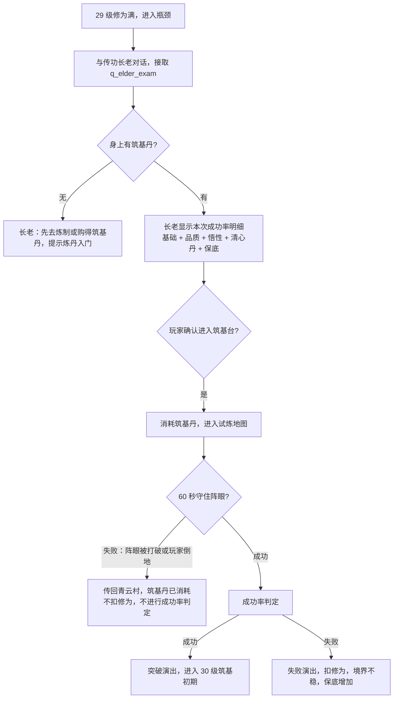

# v0.4 落地细则：瓶颈、筑基突破、炼丹一期

> 主策划：天机阁 ｜ 对应 ROADMAP v0.4「炼气到筑基」。框架见 `03_境界与功法.md`，数值见演武堂 `balance/03_数值填表.md` 和各 json。本文只定**表现、流程、界面**。

## 〇、v0.4 的场景假设（未定先这么做）
- 天剑宗山门和落霞镇是 v0.5 以后的内容，v0.4 里**不做新城镇**：
  - **传功长老** `tianjian_elder` 暂时站在青云村广场，跟接引使站在一起，剧情上说是「来青云村收徒」。
  - **炼丹入门**暂时交给青云村的**孙郎中** `doctor_sun`。正式的葛丹师在落霞镇做好后再接手，丹方和丹炉的数据不用变。
  - **筑基台** `trial_foundation_altar` 是一张独立的试炼小地图，通过跟长老对话进入，打完传回青云村。
- 等以后有了山门地图，只需要改 `npcs.json` 里的 `map` 字段。

## 一、瓶颈表现（适用于 9 级和 29 级）
| 元素 | 表现 |
|---|---|
| 修为条 | 满了以后变成金色并缓慢呼吸发光，条上的文字换成「修为已满，需突破」（`realm.bottleneck`） |
| 首次进入瓶颈 | 屏幕中间飘字，再弹一条系统提示 `realm.bottleneck_tip`，指向发布突破任务的 NPC |
| 溢出池 | 修为条右边加一个小葫芦图标，鼠标悬停显示「溢出修为 {n}/{上限}」，满了以后葫芦冒光 |
| 获得修为 | 飘字照常出现，但颜色变灰，带「（存入溢出池）」字样，让玩家知道没白打 |
| 等级 | 不涨，属性不变，**升级不回满**的问题跟 G2 一起修（瓶颈级不触发升级回满） |

## 二、筑基突破流程（29 → 30）



> 规则补充：**试炼本身失败**（没守住）算操作失误，只消耗丹药，不扣修为也不加保底；**守住了但成功率没判过**才走第 1.4 节的失败惩罚。这样「运气差」和「打得差」是分开的。

### 2.1 筑基台试炼分镜
| 时间 | 内容 |
|---|---|
| 0s | 进入一块圆形石台，中间是发光的聚灵阵（阵眼，有自己的气血条），长老的虚影在旁边护法。顶部出现 60 秒倒计时 |
| 0–20s | 第一波：心魔小怪从两侧走过来，目标是阵眼 |
| 20–40s | 第二波：加入会飞的小怪，要跳起来打（检验二段跳加剑气斩） |
| 40–55s | 第三波：两侧同时刷，阵眼附近落下天雷警示圈（玩家站在圈里会受伤，引导走位） |
| 55–60s | 最后 5 秒，屏幕边缘发金光，怪物全部退散 |
| 60s | 进入成功率判定演出 |

怪物 id、波次数量、阵眼气血 【演武堂】，暂定沿用 `trials.json` 的 `waves` 字段。

### 2.2 判定演出（约 3 秒，不可跳过）
1. 角色在阵中盘坐，镜头慢慢推近。
2. 四周灵气聚成光柱灌入角色，屏幕中央的「成功率圆环」从 0 转到结果。
3. **成功**：金光炸开，祥云散开，飘字 `realm.breakthrough_ok`，属性面板上跃升的数值逐行亮起；然后弹出「解锁：御剑飞行、二转」提示（v0.4 先只显示提示，功能留到后面的版本）。
4. **失败**：光柱碎裂，屏幕抖动并发灰，飘字 `realm.breakthrough_fail`，下面显示「下次成功率 +{bonus}%」（保底），给玩家下一次的盼头。

## 三、炼丹一期

### 3.1 范围
- 一期只做：采集灵草、学丹方、丹炉炼制、火候小游戏、炼丹等级。
- 一期丹方：`recipe_hp_pill` 回春丹、`recipe_qi_pill` 回气丹、`recipe_clear_mind` 清心丹、`recipe_foundation` 筑基丹（v0.4 突破必需）。
- 丹炉一期只有 `bronze_furnace`。

### 3.2 入门任务 `q_alchemy_intro`（孙郎中，等级 12）
- 【孙郎中】你如今入了炼气，该学学炼丹了。修仙路上，丹药就是半条命。
- 【孙郎中】去竹林采三株灵草回来，我教你炼一炉回春丹。
- 目标：采集 `spirit_herb` ×3 → 跟孙郎中对话 → 在丹炉炼成 1 次回春丹。
- 奖励：`bronze_furnace`，丹方 `recipe_hp_pill` 和 `recipe_qi_pill`，修为 【演武堂】。
- 清心丹和筑基丹的丹方：孙郎中商店卖（价格 【演武堂】），筑基丹的丹方要 20 级以上才能买。

### 3.3 采集
- 地图上灵草长成一个小发光植物，玩家靠近时头顶出现「Z 采集」。
- 按住 Z 读条（`gather.castMs`），角色蹲下做采集动作，读条期间被攻击就中断。
- 采完灵草消失，到 `respawnMs` 再长出来。
- 跟拾取共用 Z 键：附近有掉落物时优先拾取，没有掉落物才采集。

### 3.4 丹炉界面（背包里使用丹炉，或在孙郎中旁边打开）
```
┌───────────── 炼丹 ─────────────┐
│ 丹方列表        │  回春丹       │
│ ▸ 回春丹  ✓     │  材料：灵草 2/2 ✓ │
│   回气丹  ✓     │       灵兔绒 1/1 ✓│
│   清心丹  ✗缺料 │  燃料：灵石 10    │
│                 │  成功率：82%      │
│                 │  [炼制] [×5 批量] │
└────────────────────────────────┘
```
- 左边是已学的丹方，材料不够的显示灰色并标「缺料」。
- 右边是材料齐不齐、灵石燃料、预估成功率（不含火候）。
- **批量炼制**：一次炼 5 炉，自动跳过火候小游戏。

### 3.5 火候小游戏
- 一根横条，上面有一个指针来回移动，中间一段是「文火区」，正中有一条更窄的「正中线」。
- 按空格停下指针：停在正中线、停在文火区、按偏了、跳过，四种结果的加成按 `recipes.json` 的 `fire`。
- 只有一次机会，大约 2 秒。界面上始终有「跳过」按钮。
- **定稿参数**：文火区占条长 26%，正中线 4%（比示意稍宽，单机不必太苛刻）；指针来回一趟 1.2 秒，匀速，不加速；文火区位置每炉随机，但始终完整落在条内。参数写进 `recipes.json` 的 `rules.fire` 下面（`zoneWidth` `perfectWidth` `periodMs`），交 @演武堂 落表。

### 3.6 结果
- 成功：丹炉冒白烟加金光，显示品质（下 / 中 / 上 / 极），极品有特殊音效。
- 失败：冒黑烟，材料没了，灵石也扣了，炼丹经验给一半。
- 炼丹等级在丹炉界面顶部显示「炼丹 Lv.{n}」和经验条。

## 四、新增文案 key（追加进 strings_zh.json）
`alchemy.title`、`alchemy.lack`、`alchemy.success`、`alchemy.fail`、`alchemy.quality.*`、`gather.prompt`、`gather.interrupted`、`trial.countdown`、`trial.altar_broken`、`trial.success`、`realm.next_bonus`。

## 五、对接
- **@演武堂**：试炼的波次和阵眼气血、`q_alchemy_intro` 的奖励、丹方售价、筑基丹残片的产出量（要保证玩家到 29 级时能凑齐 5 片）。
- **@炼器阁**：瓶颈的修为条状态、溢出池图标、试炼地图的倒计时和阵眼对象、成功率圆环演出、采集交互、丹炉界面、火候小游戏。
- **@丹青阁**：金色修为条、葫芦图标、筑基台场景、心魔小怪（地面和飞行各 1 种）、天雷警示圈、成功和失败两套演出特效、丹炉界面、灵草采集点、4 种丹药图标。

---
## 附录 A：妖兽图鉴一期（v0.4，GDD 15.9，P1）

### A1. 解锁规则
| 阶段 | 条件（击杀数） | 卡片显示 |
|---|---|---|
| 未见 | 0，且没在屏幕上见过 | 不显示（只占一个「？」格子） |
| 剪影 | 见过但没击杀 | 黑色剪影 + 名字「？？？」+ 出没地图 |
| 初识 | 击杀 1 | 彩图、名字、等级、出没地图、一句描述 |
| 熟知 | 击杀 50（首领 1） | 加上气血、攻击、防御、修为、掉落列表 |
| 精通 | 击杀 300（首领 5） | 卡片加金边，解锁一句「妖兽志」小故事 |

- 击杀数用存档里的全局「每种怪累计击杀数」（v0.4 起记录，旧存档从 0 开始）。G8 那份是任务进度用的，不混用。
- 首领、试炼心魔、木人桩：首领进图鉴；`heart_demon_*` 和 `training_dummy` 不进。

### A2. 收集奖励（永久）
| 收集进度（达到「熟知」的比例） | 奖励 |
|---|---|
| 25% | 对所有妖兽伤害 +1% |
| 50% | 再 +1%，称号「识妖」 |
| 100%（当前版本全部） | 再 +1%，称号「百妖通」 |
> 数值由 @演武堂 确认；版本加怪后比例会下降，已获得的奖励不回收。

### A3. 界面
- 打开键：`B`（图鉴）。左侧按区域分页（青云村周边、落霞郊野……），右侧卡片网格，点卡片看详情。
- 卡片尺寸和排版以丹青阁的卡片样式为准。
- 新解锁一档时，屏幕右下角弹小提示「图鉴更新：{monster}」。

### A4. 配置
- `monsters.json` 新增可选字段 `bestiary`：`{ "lore": "妖兽志文字", "exclude": false }`。不写就用默认值（进图鉴、没有小故事）。
- 文案 key：`bestiary.title`、`bestiary.unknown`、`bestiary.update`、`bestiary.stage.*`。

### A5. 一期妖兽志（v0.4 范围内）
| 怪 | 描述（初识） | 妖兽志（精通） |
|---|---|---|
| 灵兔 | 竹林里吃灵笋长大的兔子，胆小，被惹急了也会撞人。 | 据说吃够一千根灵笋的灵兔会长出第三只耳朵，可惜没人见过。 |
| 竹叶青蛇 | 通体碧绿，藏在竹叶间，见人就扑。 | 青蛇胆是孙郎中的宝贝。他年轻时被咬过一次，从此对蛇恨之入骨，也爱之入骨。 |
| 山魈 | 力大无穷的山中精怪，抬手就要拍地。 | 山魈其实怕响声。老猎户说，敲锣能把它们吓退，前提是你得活着敲完。 |
| 妖狐 | 修出三尾的妖狐，善用狐火和幻术。 | 它尾巴上的光，和你身上那块碎片的光，是一样的颜色。 |
| 野猪精 | 落霞郊野的稻田大患，看准了就直冲过来。 | 落霞镇每年秋收前都要请修士来赶猪，赏钱是一顿全猪宴。 |
| 稻草傀儡 | 不知被谁注入了灵气的稻草人，呆呆地站在田里。 | 傀儡身上的符纹不是本地手法，倒像是……黑袍人用的那种。 |
| 黑袍人 | 来历不明的修士，远远地丢符伤人。 | 他们的袍角都绣着一道裂开的柱子。 |
